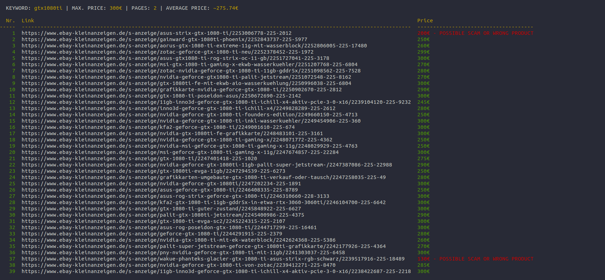

<h3>Simple scraper to filter products below a price from eBay Kleinanzeigen</h3>

<hr>



<br>

**About**

Give this scraper a keyword and maximum price and it will check as many pages as you like for products
you might want to buy. Filters out articles by keywords and calculates the average price of all articles
to detect which ones might be wrong products or scams. Results will be displayed in a nice table format.

<br>

**Install Requirements**<br>
```
pip install -r requirements.txt
```

<br>

**Usage**<br>
```
Required

scraper.py [-n NAME; --name NAME] set the article name
           [-mp PRICE; --max_price PRICE] set the maximum price


Optional

scraper.py [-p PAGES; --pages PAGES] set how many pages to scrape
           [-d DRIVER; --driver DRIVER] set which driver to use (chrome / firefox) 


Example

scraper.py -n gtx1080ti -mp 300 -p 5 -d chrome
```
